<div align="center">
  
</div>



<div align="center">
  <sub>
    <a href="https://github.com/kerimaydemir/miron-method">miron-method</a>
    &nbsp;&nbsp;/&nbsp;&nbsp;
    <a href="https://github.com/kerimaydemir/miron-x">miron-x</a>
    &nbsp;&nbsp;/&nbsp;&nbsp;
    <a href="https://github.com/kerimaydemir/kurtlarr">kurtlarr</a>
  </sub>
</div>

<br />

```txt
I build useful things.

law      -> context, research, judgment
memory   -> personal systems that do not forget
product  -> fewer screens, sharper decisions
```


