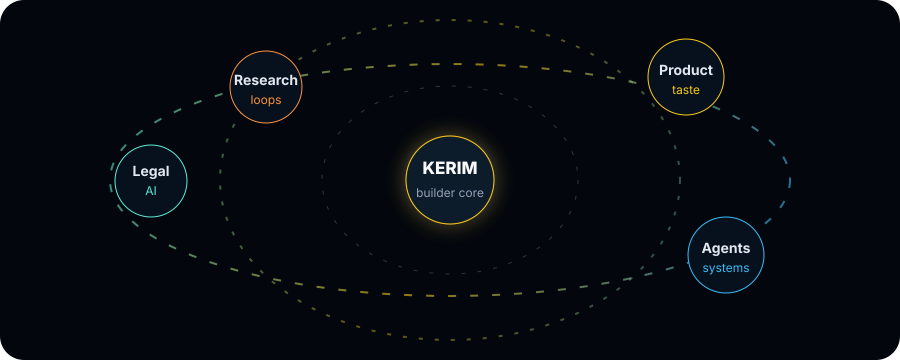

<div align="center">
  
</div>

<div align="center">
  <a href="https://github.com/kerimaydemir">
    
  </a>
</div>

<p align="center">
  <a href="https://github.com/kerimaydemir?tab=repositories">
    
  </a>
  <a href="https://github.com/kerimaydemir/miron-method">
    
  </a>
  <a href="https://github.com/kerimaydemir/miron-x">
    
  </a>
  
</p>


### Current Focus

I am Kerim Aydemir, building product-grade AI systems with a bias for clarity, speed and usefulness. My work sits around LegalTech, agentic workflows, automation and focused product experiences.

```txt
product direction  ->  legal AI workflows, research loops, polished UX
engineering        ->  Python, TypeScript, JavaScript, data-backed systems
operating style    ->  prototype fast, verify in reality, refine until it feels inevitable
```

<div align="center">
  
</div>


### Builder Stack

<p align="center">
  
</p>

<table>
  <tr>
    <td width="50%">
      <h3>What I like building</h3>
      <ul>
        <li>AI copilots that fit the actual workflow</li>
        <li>Legal research and document intelligence systems</li>
        <li>Automation that removes repeated human effort</li>
        <li>Interfaces that feel premium without becoming noisy</li>
      </ul>
    </td>
    <td width="50%">
      <h3>How I think</h3>
      <ul>
        <li>Ship small, learn fast, keep the standard high</li>
        <li>Prefer source-backed claims over vague confidence</li>
        <li>Make products simpler until the value becomes obvious</li>
        <li>Use AI as leverage, not decoration</li>
      </ul>
    </td>
  </tr>
</table>


### Selected Work

<div align="center">
  <table>
    <tr>
      <td align="center" width="50%">
        <a href="https://github.com/kerimaydemir/miron-method"><b>miron-method</b></a>
        <br />
        <sub>Python-heavy system work around AI/product workflows.</sub>
        <br /><br />
        
        
        
      </td>
      <td align="center" width="50%">
        <a href="https://github.com/kerimaydemir/miron-x"><b>miron-x</b></a>
        <br />
        <sub>JavaScript product surface with a fast iteration rhythm.</sub>
        <br /><br />
        
        
      </td>
    </tr>
  </table>
</div>


### GitHub Signal

<div align="center">
  
</div>

<div align="center">
  
  
</div>

<div align="center">
  
  
</div>

<div align="center">
  
</div>

<picture>
  <source media="(prefers-color-scheme: dark)" srcset="https://raw.githubusercontent.com/kerimaydemir/kerimaydemir/output/github-snake-dark.svg" />
  <source media="(prefers-color-scheme: light)" srcset="https://raw.githubusercontent.com/kerimaydemir/kerimaydemir/output/github-snake.svg" />
  
</picture>


<div align="center">
  <b>Focused systems. Premium product feel. Useful AI.</b>
  <br />
  <sub>Currently sharpening AI products around LegalTech, agents and automation.</sub>
</div>
